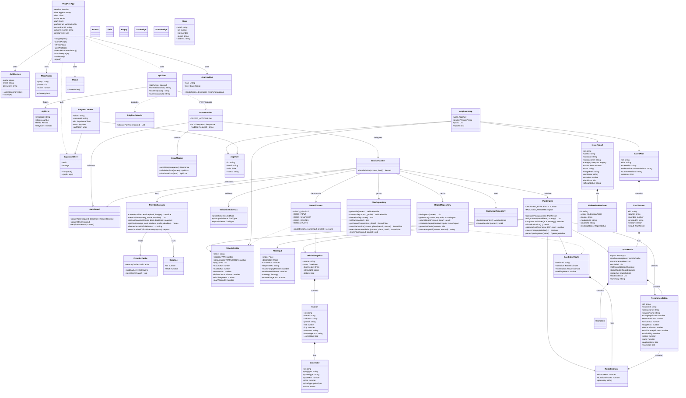

```mermaid
classDiagram
    %% ===== PRESENTATION LAYER =====
    class PlugPlanApp {
        -session: Session
        -data: AppBootstrap
        -view: View
        -mode: Mode
        -draft: Draft
        -profileDraft: VehicleProfile
        -currentPlanId: string
        -activeVersionId: string
        -compareIds: List
        +navigate(view)
        +submitPlan(e)
        +refreshPlan()
        +saveProfile(e)
        +selectRecommendation(r)
        +submitReport(e)
        +moderate(e)
        +logout()
    }
    class AuthScreen {
        -mode: signin
        -email: string
        -password: string
        +socialSignIn(provider)
        +submit(e)
    }
    class PlacePicker {
        -query: string
        -places: List
        -active: number
        +choose(place)
    }
    class JourneyMap {
        -map: L.Map
        -layer: LayerGroup
        +render(origin, destination, recommendations)
    }
    class Modal {
        +showModal()
    }
    class Button
    class Field
    class Empty
    class DataBadge
    class StatusBadge

    %% ===== CLIENT API LAYER =====
    class ApiClient {
        +api(action, payload)
        +formatSG(value) string
        +localSG(value) string
        +currency(value) string
    }
    class SupabaseClient {
        +auth
        +storage
        +from(table)
        +rpc(fn, args)
    }
    class ApiError {
        +message: string
        +status: number
        +fields: Record
        +retryAfter: number
    }

    %% ===== API ROUTE / CONTROLLER LAYER =====
    class RouteHandler {
        +POST(request) Response
        -readBody(request) string
        -DRIVER_ACTIONS: Set
    }
    class ServiceHandler {
        +handleAction(context, body) Record
    }
    class RequestContext {
        +token: string
        +sessionId: string
        +db: SupabaseClient
        +user: AppUser
        +authUser: User
    }
    class AuthGuard {
        +requireUser(request, deadline) RequestContext
        +requireDriver(context)
        +requireModerator(context)
    }
    class ErrorMapper {
        +errorResponse(error) Response
        +validationError(issues) ApiError
        +databaseError(error) ApiError
    }

    %% ===== DOMAIN / ENGINE LAYER =====
    class PlanEngine {
        -CHARGING_EFFICIENCY: number
        -BALANCED_WEIGHTS: object
        +calculatePlan(params) PlanResult
        -assignScores(candidates, strategy) List
        -compareCandidates(a, b, strategy) number
        -failureForStation(...) result
        -estimateCost(connector, kWh, min) number
        -coversChargingWindow(...) boolean
        -parseOpeningHours(value) OpeningWindow
    }
    class ValidationSchemas {
        +profileSchema: ZodType
        +planInputSchema: ZodType
        +reportSchema: ZodType
    }
    class DemoFixtures {
        +DEMO_PROFILE
        +DEMO_INPUT
        +DEMO_SNAPSHOT
        +DEMO_ROUTES
        +DEMO_FAULTS
        +createDemoScenario(input, profile) scenario
    }
    class PolylineDecoder {
        +decodePolyline(encoded) List
    }

    %% ===== PROVIDER LAYER =====
    class ProviderGateway {
        +createProviderDeadline(fetch, budget) Deadline
        +searchPlaces(query, mode, deadline) List
        +getLiveSnapshot(origin, dest, deadline) snapshot
        +getRoutes(origin, dest, stations, profile, deadline) routes
        +formatCachedOfficialStatus(...) string
        +attachCachedOfficialStatuses(reports) reports
    }
    class ProviderCache {
        -memoryCache: DiskCache
        +loadCache() DiskCache
        +saveCache(value) void
    }
    class Deadline {
        +at: number
        +fetch: function
    }

    %% ===== PERSISTENCE LAYER =====
    class PlanRepository {
        +getProfile(context) VehicleProfile
        +saveProfile(context, profile) VehicleProfile
        +deleteProfile(context) void
        +listPlans(context) List
        +getOwnedPlan(context, planId) SavedPlan
        +savePlanVersion(context, planId, result, reason) SavedPlan
        +selectRecommendation(context, planId, recId) SavedPlan
        +deletePlan(context, planId) void
    }
    class ReportRepository {
        +listReports(context) List
        +getReport(context, reportId) IssueReport
        +submitReport(context, input) result
        +moderateReport(context, input) IssueReport
        +getActiveFaults(context) List
        +createImageUrl(context, reportId) string
    }
    class BootstrapRepository {
        +bootstrap(context) AppBootstrap
        +revokeSession(context) void
    }

    %% ===== DOMAIN TYPES =====
    class AppUser {
        +id: string
        +email: string
        +role: Role
        +status: string
    }
    class VehicleProfile {
        +name: string
        +capacityKWh: number
        +consumptionKWhPer100Km: number
        +plugTypes: List
        +maxAcKw: number
        +maxDcKw: number
        +reserveSoc: number
        +defaultDetourMinutes: number
        +minChargerKw: number
        +maxWalkingM: number
    }
    class Place {
        +label: string
        +lat: number
        +lng: number
        +postal: string
        +address: string
    }
    class PlanInput {
        +origin: Place
        +destination: Place
        +currentSoc: number
        +departureAt: string
        +maxChargingMinutes: number
        +maxDetourMinutes: number
        +strategy: Strategy
        +manualTargetSoc: number
    }
    class Station {
        +id: string
        +name: string
        +address: string
        +postal: string
        +lat: number
        +lng: number
        +operator: string
        +openingHours: string
        +connectors: List
    }
    class Connector {
        +id: string
        +plugType: string
        +powerType: string
        +powerKw: number
        +price: number
        +priceType: priceType
        +status: status
    }
    class OfficialSnapshot {
        +source: string
        +state: DataState
        +observedAt: string
        +retrievedAt: string
        +stations: List
    }
    class RouteEstimate {
        +distanceKm: number
        +durationMinutes: number
        +geometry: string
    }
    class CandidateRoute {
        +stationId: string
        +toStation: RouteEstimate
        +fromStation: RouteEstimate
        +walkingMeters: number
    }
    class Recommendation {
        +id: string
        +stationId: string
        +connectorId: string
        +stationName: string
        +chargingMinutes: number
        +estimatedCost: number
        +arrivalSoc: number
        +targetSoc: number
        +detourMinutes: number
        +totalJourneyMinutes: number
        +availability: number
        +score: number
        +rank: number
        +explanations: List
        +warnings: List
    }
    class PlanResult {
        +inputs: PlanInput
        +profileAssumptions: VehicleProfile
        +recommendations: List
        +excluded: List
        +noChargeNeeded: boolean
        +directRoute: RouteEstimate
        +snapshot: snapshotInfo
        +faultEvidence: List
        +summary: string
    }
    class SavedPlan {
        +id: string
        +title: string
        +createdAt: string
        +selectedRecommendationId: string
        +currentVersionId: string
        +versions: List
    }
    class PlanVersion {
        +id: string
        +planId: string
        +number: number
        +createdAt: string
        +reason: reason
        +result: PlanResult
    }
    class IssueReport {
        +id: string
        +userId: string
        +stationId: string
        +stationName: string
        +category: ReportCategory
        +status: ReportStatus
        +note: string
        +imagePath: string
        +expiresAt: string
        +revision: number
        +decisions: List
        +officialStatus: string
    }
    class ModerationDecision {
        +id: string
        +action: ModerationAction
        +reason: string
        +moderatorId: string
        +createdAt: string
        +resultingStatus: ReportStatus
    }
    class AppBootstrap {
        +user: AppUser
        +profile: VehicleProfile
        +plans: List
        +reports: List
    }

    %% ===== RELATIONSHIPS =====
    PlugPlanApp --> AuthScreen : uses
    PlugPlanApp --> PlacePicker : uses
    PlugPlanApp --> JourneyMap : uses
    PlugPlanApp --> Modal : uses
    PlugPlanApp ..> ApiClient : calls
    PlugPlanApp ..> SupabaseClient : auth

    ApiClient --> ApiError : throws
    ApiClient ..> RouteHandler : POST /api/app

    RouteHandler --> AuthGuard : validates
    RouteHandler --> ServiceHandler : delegates
    RouteHandler --> ErrorMapper : on error

    ServiceHandler --> PlanEngine : calculate
    ServiceHandler --> PlanRepository : persist
    ServiceHandler --> ReportRepository : persist
    ServiceHandler --> BootstrapRepository : load
    ServiceHandler --> ProviderGateway : fetch
    ServiceHandler --> ValidationSchemas : validates
    ServiceHandler --> DemoFixtures : demo mode
    ServiceHandler --> AuthGuard : role check

    ProviderGateway --> Deadline : uses
    ProviderGateway --> ProviderCache : reads

    PlanEngine --> PlanInput
    PlanEngine --> VehicleProfile
    PlanEngine --> OfficialSnapshot
    PlanEngine --> RouteEstimate
    PlanEngine --> CandidateRoute
    PlanEngine --> PlanResult
    PlanEngine --> Recommendation : creates

    PlanResult *-- Recommendation : contains
    PlanResult *-- Exclusion : contains
    SavedPlan *-- PlanVersion : contains
    PlanVersion *-- PlanResult : has
    IssueReport *-- ModerationDecision : has
    Station *-- Connector : has
    OfficialSnapshot *-- Station : contains
    CandidateRoute *-- RouteEstimate : has
    Recommendation --> RouteEstimate : toStation

    AppBootstrap --> AppUser
    AppBootstrap --> VehicleProfile
    AppBootstrap --> SavedPlan
    AppBootstrap --> IssueReport

    RequestContext --> AppUser
    RequestContext --> SupabaseClient

    JourneyMap ..> PolylineDecoder : decodes
    DemoFixtures ..> OfficialSnapshot
    DemoFixtures ..> CandidateRoute
    DemoFixtures ..> VehicleProfile
```